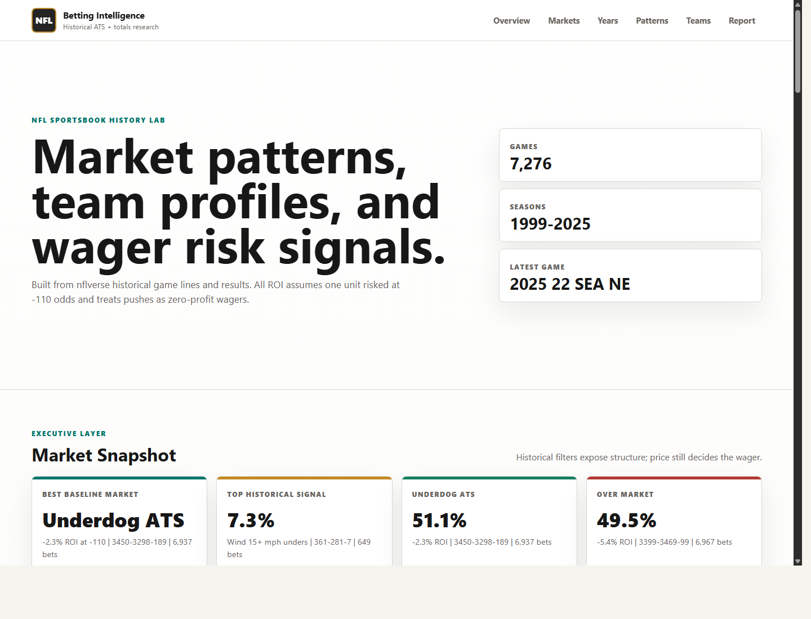

# NFL Betting Intelligence Dashboard - https://hnguyen76.github.io/NFL/
Professional static dashboard and report for NFL sportsbook history, built from
historical nflverse game lines and results.



## What is included

- `index.html`, `styles.css`, `app.js` - polished static dashboard for GitHub Pages.
- `data/games.csv` - nflverse historical game data with spreads, totals, scores, venue, weather, and rest fields.
- `data/teamcolors.csv`, `data/logos.csv` - team branding data used by the dashboard.
- `data/dashboard_data.js` - generated analytics payload consumed by the frontend.
- `src/build_dashboard_data.py` - no-dependency Python pipeline that rebuilds the analytics layer.
- `docs/report.md` - written professional betting-history report and methodology.

## Key historical findings

- Blind baseline betting is negative after -110 vig across the major markets.
- Underdogs have performed better than favorites historically, but broad ATS
  underdog betting is still slightly negative after vig.
- Recent seasons shifted sharply:
  - 2020 rewarded underdogs, especially division dogs.
  - 2021-2023 rewarded unders, with wind-driven unders strongest.
  - 2024 flipped toward overs and punished blind unders.
  - 2025 had no clean broad edge; price discipline mattered most.
- Wind-driven unders are the strongest signal in this dataset:
  - Wind 15+ mph unders: 361-281-7, 56.2% win rate, +7.3% ROI.
  - Wind 10+ mph unders: 969-801-23, 54.8% win rate, +4.5% ROI.
- Several popular angles are traps after vig, including freezing outdoor unders,
  high-total overs, large home favorites, and rest-disadvantage teams.

## Run locally

Open `index.html` directly in a browser. The dashboard uses a generated JS data
file, so it does not require a backend or package install.

To rebuild the analytics after updating raw data:

```powershell
python .\src\build_dashboard_data.py
```

## Methodology

- `spread_line` is evaluated from the home-team perspective.
- Home ATS margin = `result - spread_line`.
- Over/Under margin = `total - total_line`.
- ROI assumes one unit risked at -110 odds for every wager.
- Win percentage excludes pushes; ROI includes pushes as zero-profit wagers.

## Data source

Source data comes from [nflverse/nfldata](https://github.com/nflverse/nfldata).

This project is for research and education only. It is not financial advice,
betting advice, or a guarantee of future results.
